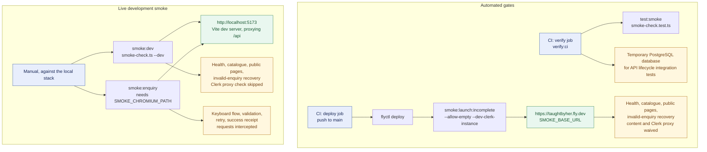

# Testing

The project uses several complementary test layers. Most automated tests use
Node's built-in `node:test` runner and are executed with `tsx`; the web tests
also use JSDOM where browser APIs are needed.

For the complete validation setup, including the deploy job, see [CI and deploy
validation](ci-validation.md).

## Smoke testing at a glance

The project has smoke **helper tests** that run against local fixtures, plus
live smoke checks that target either the local development stack or the
Deployment. The CI integration tests use a temporary database, but the smoke
helper tests do not target that database.



In short:

- `test:smoke` is a code-level test suite for target selection, waivers,
  redirects, timeouts, and response handling. It runs inside `verify:ci`; it
  does not contact a live site.
- `smoke:dev` and `smoke:enquiry` run manually against the local stack.
- `smoke:launch:incomplete` runs automatically in the deploy job. `smoke:launch`
  is the same check without the waivers, and is what to run by hand once the
  Deployment has content.
- Every mode requires `SMOKE_BASE_URL`; nothing has a default target.
- The browser enquiry checks intercept the submission response, so they do not
  create a real enquiry. The launch checks send an intentionally invalid
  enquiry payload and expect validation to reject it before insertion.

## Test suites

### API server

Run the API tests with:

```sh
pnpm --filter @workspace/api-server test
```

This is the complete API suite used by CI. It runs the in-memory unit checks
and the database-backed workspace lifecycle integration tests. The lifecycle
tests cover:

- Workspace tutor, resource, article, account, and permission lifecycles,
  including owner-only behavior and Clerk identity reuse.

Running this package test command directly does not provision a database. Use
`pnpm run verify:ci` for the CI path that creates an isolated temporary local
PostgreSQL database when `TEST_DATABASE_URL` is not supplied, applies the
current schema, runs the integration tests, and removes the temporary database
afterward.

Run only the non-mutating API checks with:

```sh
pnpm --filter @workspace/api-server run test:unit
```

These checks cover:

- Publishability rules for tutor profiles and resources.
- Supported and legacy resource type normalization.
- Request-origin normalization and protection against cross-site workspace
  mutations.

The lifecycle tests exercise the Express routes and database-backed behavior
end to end within the test process. They create, update, publish, and delete
test records and are therefore reserved for CI with an isolated test
database. Set `TEST_DATABASE_URL` to the dedicated PostgreSQL connection;
`test:integration` sets `NODE_ENV=test`, and the database package refuses to
fall back to `DATABASE_URL` or use the same URL as the application. CI must
apply the current schema to that database before running the integration
script. The CI preparation command does both checks explicitly:

```sh
pnpm run check:test-database
pnpm run prepare:test-database
```

The first command fails if `TEST_DATABASE_URL` is missing or points to
`DATABASE_URL`. The second applies the current schema using the test URL as its
target and fails with a connection-specific message if that database is not
reachable. Each process also uses a unique fixture namespace, so overlapping
runs do not reuse or delete one another's records.

### Web application

Run the Taught by Her web tests with:

```sh
pnpm --filter @workspace/taughtbyher test
```

The suite checks:

- Public and workspace route resolution, metadata, redirects, and Clerk
  callback routes.
- Homepage loading, successful tutor rendering, and retry behavior.
- Tutor profile behavior, including unavailable tutors.
- Enquiry form validation, keyboard navigation, focus management, disabled
  submit behavior, announced errors, retry behavior, and successful receipts.
- Public tutor-query caching, expiry, and mutation invalidation.
- Workspace authentication loading, approved, pending, error, and retry
  states.

React components are rendered either into JSDOM or to static markup. Network
and query behavior is supplied by test doubles rather than making real
production requests.

### Repository scripts

The script package tests the smoke-check and documentation-check helpers:

```sh
pnpm --filter @workspace/scripts run test:smoke
```

The smoke-check tests validate target selection, the waiver flags in both
directions, redirect protection, timeout handling, and healthy responses
against a local fixture. The documentation tests ensure that `pnpm` commands —
in the docs and in the workflows' `run:` steps — refer to real package scripts.

## Static verification

Run the repository-wide type checks with:

```sh
pnpm run typecheck
```

Run the normal build verification with:

```sh
pnpm run build
```

The build first checks documented commands, then type-checks libraries and
workspace packages, and finally builds the packages that define a build script.
The mockup sandbox has no test script; it is covered by its TypeScript
type-check and build when those workspace checks run.

## Launch and browser smoke checks

The non-mutating launch smoke check verifies a running target's API health,
Clerk environment proxy, published tutor and resource catalogue data, public
pages, invalid-enquiry validation, and recovery health check:

```sh
SMOKE_BASE_URL=https://taughtbyher.fly.dev pnpm smoke:launch
```

`SMOKE_BASE_URL` is required in every mode and has no default. It does not
require workspace credentials, and it rejects a target that redirects to
another origin.

The Playwright-based enquiry smoke check runs the real form in Chromium. It
checks native Tab and Enter interaction, validation recovery, disabled-submit
behavior, announced network errors, retry behavior, successful receipts, and
preselected tutor profiles. Requests are intercepted so the check does not
create real Enquiries:

```sh
SMOKE_BASE_URL=http://localhost:5173 \
  SMOKE_CHROMIUM_PATH=/path/to/chromium pnpm smoke:enquiry
```

Per-request and overall smoke timeouts can be adjusted with `SMOKE_TIMEOUT_MS`
and `SMOKE_TOTAL_TIMEOUT_MS`. The waiver flags, and the conditions that end
them, are in [launch-smoke-check.md](launch-smoke-check.md).

For the deploy job and the release sequence, see [CI and deploy
validation](ci-validation.md).

## Recommended verification sequence

For a normal change, run the affected package test suite first, then:

```sh
pnpm run typecheck
pnpm run build
```

Run the launch or enquiry smoke checks when the change affects routing, public
API responses, deployment configuration, or the enquiry journey.

Before merging, use `pnpm run verify:ci` for the complete check. It requires
and prepares the dedicated test database before running the database-backed API
lifecycle tests. That is the same gate CI runs, and on `main` it is what a
deploy waits for.
